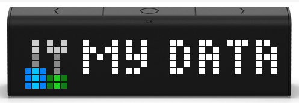

# LaMetric My Data Dataset Provider

Provide a dataset for the LaMetric
[My Data (DIY)](https://apps.lametric.com/apps/my_data__diy_/8942) app.

## Vision

This project allows editing and serving a file used by the LaMetric app
[My Data (DIY)](https://apps.lametric.com/apps/my_data__diy_/8942).

- One change field only, no wizards or multistep forms
- Provide a file for PULL methods, don't support PUSH methods
- KISS

## Requirements

- PHP

## Installation

Packagist Entry https://packagist.org/packages/pixelbrackets/lametric-my-data-dataset-provider/

- Point your webserver to the `web` directory
- Add the complete URL to the data file `frames.json` to your »My Data (DIY)«
  app settings, for example `https://example.com/frames.json`

## Source

https://gitlab.com/pixelbrackets/lametric-my-data-dataset-provider/

Mirror https://github.com/pixelbrackets/lametric-my-data-dataset-provider/

## Usage

- Set the environment variable `BASEURL` to overwrite the domain in the homepage

## License

GNU General Public License version 2 or later

The GNU General Public License can be found at http://www.gnu.org/copyleft/gpl.html.

## Author

Dan Untenzu (<mail@pixelbrackets.de> / [@pixelbrackets](https://pixelbrackets.de))

## Changelog

See [./CHANGELOG.md](CHANGELOG.md)

## Contribution

This script is Open Source, so please use, patch, extend or fork it.

[Contributions](CONTRIBUTING.md) are welcome!
